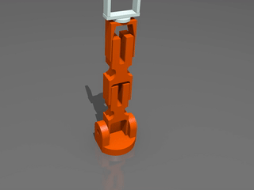

# Arduino UNOQ Braccio

Control a TinkerKit Braccio arm with an Arduino UNO Q, ROS 2, Edge Impulse,
and Gazebo.

```text
ROS 2 host -> tcp_bridge -> UNO Q agent -> servos
```

<p align="center">
  
</p>

## Contents

- [Overview](#overview)
- [Gallery](#gallery)
- [Repository Layout](#repository-layout)
- [Hardware](#hardware)
- [Quick Start](#quick-start)
  - [1. Build the ROS 2 workspace](#1-build-the-ros-2-workspace)
  - [2. Run the simulation](#2-run-the-simulation)
  - [3. Flash the UNO Q](#3-flash-the-uno-q)
  - [4. Run the hardware bridge over USB](#4-run-the-hardware-bridge-over-usb)
  - [5. Run the hardware bridge over the network](#5-run-the-hardware-bridge-over-the-network)
- [Simulation Commands](#simulation-commands)
- [Command Protocol](#command-protocol)
- [Vision and Edge Impulse](#vision-and-edge-impulse)
- [Data Capture and Robot Stats](#data-capture-and-robot-stats)
- [Web Control](#web-control)
- [App Lab Brick](#app-lab-brick)
- [Documentation Index](#documentation-index)

## Overview

This repository contains:

- Arduino firmware using the official
  [arduino-libraries/Braccio](https://github.com/arduino-libraries/Braccio)
  library.
- ROS 2 USB serial and remote TCP bridges that convert
  `sensor_msgs/JointState` commands into Braccio servo angles.
- A Gazebo/ros2_control simulation with a gripper camera, an overhead camera,
  colored blocks and drop bins, and a vision-driven pick-and-place demo.
- Edge Impulse integration for camera object detection and classifier-driven
  arm poses, plus CSV data capture of commanded servo motion.
- USB camera vision with OpenCV color tracking.
- A browser dashboard and App Lab apps for remote control.

## Gallery

### Gazebo simulator

<p align="center">

</p>

### Actual Braccio

<p align="center">

</p>

### Web UI

<p align="center">

</p>

## Repository Layout

```text
firmware/unoq_braccio_firmware/     USB serial firmware for UNO Q + Braccio
app_lab/braccio_smoke_test/         Arduino App Lab hardware smoke test
app_lab/braccio_remote_agent/       Arduino App Lab network control agent
app_lab/usb_camera_streamer/        UNO Q attached USB camera MJPEG streamer
app_lab/braccio_web_agent/          Combined web dashboard control/camera agent
app_lab/bricks/unoq_braccio_bridge/ Reusable App Lab Braccio bridge brick
web_app/                            Browser dashboard for remote arm control
ros2_ws/src/unoq_braccio_bringup/   ROS 2 launch files and runtime config
ros2_ws/src/unoq_braccio_driver/    Bridges, kinematics, vision, demo nodes
ros2_ws/src/unoq_braccio_sim/       URDF, Gazebo world, ros2_control config
edge_impulse/                       Classifier mapping examples and notes
scripts/                            Setup and helper scripts
docs/                               Hardware, architecture, workflow docs
```

Architecture details: [docs/architecture.md](docs/architecture.md).

## Hardware

- Arduino UNO Q
- TinkerKit Braccio robot arm and Braccio shield
- USB serial or Wi-Fi/Ethernet network connection to the ROS 2 host
- 5 V power supply for the Braccio servos

The firmware expects the Arduino Braccio library to be installed through the
Arduino IDE Library Manager or `arduino-cli`. Wiring, joint limits and gripper
notes are in [docs/hardware.md](docs/hardware.md).

## Quick Start

For full setup on Windows, macOS, and Linux, see
[docs/platform-setup.md](docs/platform-setup.md).

### 1. Build the ROS 2 workspace

Tested target: ROS 2 Jazzy on Ubuntu 24.04.

```bash
cd ros2_ws
rosdep install --from-paths src --ignore-src -r -y
colcon build --symlink-install
source install/setup.bash
cd ..
```

### 2. Run the simulation

No hardware needed. See [Simulation Commands](#simulation-commands) for
everything you can run once it is up.

```bash
source ros2_ws/install/setup.bash
ros2 launch unoq_braccio_bringup sim.launch.py
```

### 3. Flash the UNO Q

For a first hardware check through Arduino App Lab, use
[app_lab/braccio_smoke_test](app_lab/braccio_smoke_test). For direct
`arduino-cli` flashing:

```bash
arduino-cli lib install Braccio
arduino-cli core install arduino:zephyr
arduino-cli board list
arduino-cli compile --fqbn arduino:zephyr:unoq firmware/unoq_braccio_firmware
arduino-cli upload -p /dev/ttyACM0 --fqbn arduino:zephyr:unoq firmware/unoq_braccio_firmware
```

The Braccio shield sits on the UNO Q headers. Do not use `arduino:avr:uno`;
UNO Q builds target the Zephyr-based MCU core with `arduino:zephyr:unoq`.

Validated Windows network upload path:

```powershell
arduino-cli board list
arduino-cli upload -p 192.168.1.64 --fqbn arduino:zephyr:unoq .\firmware\unoq_braccio_firmware --upload-field password=arduino123
```

Replace `192.168.1.64` and `arduino123` with your UNO Q network address and
upload password. This path avoids the Windows USB ADB `device offline` issue.

### 4. Run the hardware bridge over USB

```bash
source ros2_ws/install/setup.bash
ros2 launch unoq_braccio_bringup hardware.launch.py serial_port:=/dev/ttyACM0
ros2 run unoq_braccio_driver pose_demo --ros-args -p pose:=ready
```

Windows USB debug:

```powershell
arduino-cli board list
arduino-cli monitor -p COM4 --fqbn arduino:zephyr:unoq --config baudrate=115200
```

Replace `COM4` with the port shown by `arduino-cli board list`. The firmware
uses `115200` baud. Send `M 90 90 90 90 90 25` to test the arm; the expected
response is `OK`.

### 5. Run the hardware bridge over the network

Install and run the App Lab project in `app_lab/braccio_remote_agent` on the
UNO Q, then launch the ROS 2 TCP bridge:

```bash
source ros2_ws/install/setup.bash
ros2 launch unoq_braccio_bringup remote.launch.py host:=<UNO_Q_IP_ADDRESS> port:=8765
ros2 run unoq_braccio_driver pose_demo --ros-args -p pose:=ready
```

## Simulation Commands

Launch the simulator first (`ros2 launch unoq_braccio_bringup sim.launch.py`),
then run any of these in a second terminal with the workspace sourced.

**Named poses** (`rest`, `ready`, `grip_test`, `grip_full`, `pickup`, `drop`,
`wave`):

```bash
ros2 run unoq_braccio_driver pose_demo --ros-args -p pose:=ready
ros2 run unoq_braccio_driver pose_demo --ros-args -p pose:=wave
```

**Move to an x/y/z target** (metres; arm base at the origin, facing +x):

```bash
ros2 run unoq_braccio_driver ik_pose_demo --ros-args \
  -p x:=0.30 -p y:=0.00 -p z:=0.06 -p gripper:=25
```

**Vision-driven pick and place.** The overhead camera finds each block, IK
picks it, and the arm drops it in the bin of the same color:

```bash
ros2 run unoq_braccio_driver pick_place_demo
ros2 run unoq_braccio_driver pick_place_demo --ros-args -p colors:="[blue]"
```

**Launch options:**

```bash
ros2 launch unoq_braccio_bringup sim.launch.py detector:=false      # no cube detector
ros2 launch unoq_braccio_bringup sim.launch.py fallback_sim:=true   # debug only
```

**Camera feeds and checks:**

```text
/vision/overhead/image_raw   fixed overhead camera
/vision/gripper/image_raw    gripper-mounted camera
/vision/cube_target          averaged cube positions (JSON)
```

```bash
ros2 topic hz /clock              # arm not moving? the sim clock must be running
ros2 control list_controllers
```

The scene has red, blue and yellow 50 mm blocks and matching drop bins, all
within the arm's reach. Details, servo conventions and current limitations are
in [ros2_ws/src/unoq_braccio_sim/README.md](ros2_ws/src/unoq_braccio_sim/README.md).

## Command Protocol

The USB serial firmware and remote App Lab agent both use the same command
protocol:

```text
M <base> <shoulder> <elbow> <wrist_vertical> <wrist_rotation> <gripper>
```

Angles are integer degrees. The firmware clamps values to the conservative
Braccio operating ranges before moving servos. Send `S` to query status.

## Vision and Edge Impulse

The easiest sight path is a USB camera on the ROS 2 host:

```bash
source ros2_ws/install/setup.bash
ros2 launch unoq_braccio_bringup vision_usb.launch.py camera_index:=0 label:=object
```

If the camera is plugged into the UNO Q instead, run
`app_lab/usb_camera_streamer` on the UNO Q and use:

```bash
ros2 launch unoq_braccio_bringup vision_remote.launch.py \
  stream_url:=http://<UNO_Q_IP_ADDRESS>:8080/stream label:=object
```

For Edge Impulse object detection and item-specific pick/place:

```bash
ros2 launch unoq_braccio_bringup edge_impulse_pick_place.launch.py \
  stream_url:=http://192.168.1.64:8080/stream \
  runner_command:="python3 edge_impulse/runner_template.py --image {image}" \
  workflow_file:=edge_impulse/pick_place_workflows.yaml
```

Public Edge Impulse project: <https://studio.edgeimpulse.com/studio/1029890>
(labels `Red Block`, `Blue Block`, `Yellow Block`). Keep API keys in
`EDGE_IMPULSE_API_KEY`, not in committed files.

More detail:

- [docs/vision.md](docs/vision.md): camera options and visual alignment
- [edge_impulse/README.md](edge_impulse/README.md): label-to-pose mapping,
  runner commands and the `edgeimpulse_ros` backend
- [edge_impulse/linux_setup.md](edge_impulse/linux_setup.md): Linux `.eim`
  setup and authentication

## Data Capture and Robot Stats

Standard Braccio servos do not report current, torque, temperature, or measured
position, so this project captures commanded joint angles, deltas, labels and
firmware/remote-agent status as CSV:

```bash
ros2 launch unoq_braccio_bringup data_capture.launch.py \
  output_file:=edge_impulse/captures/braccio_capture.csv label:=ready
```

See [edge_impulse/data_capture.md](edge_impulse/data_capture.md).

## Web Control

Run the App Lab project `app_lab/braccio_web_agent` on the UNO Q (open or copy
its folder in Arduino App Lab; it is not a shell command). It exposes arm
control on port `8765` and the camera stream on `8080`, and uses direct Servo
control so `Braccio.h` is not required in App Lab. Then start the dashboard:

```bash
cd web_app
python server.py --host 0.0.0.0 --port 5000 --unoq-host 192.168.1.64
```

Open <http://localhost:5000> for the camera stream, robot status, preset poses
and manual joint sliders.

Gripper tuning: this build allows the gripper to close up to `110` degrees. Use
the dashboard `grip_test` preset first, then `grip_full` only if needed.

See [web_app/README.md](web_app/README.md) and
[app_lab/braccio_web_agent/README.md](app_lab/braccio_web_agent/README.md).

## App Lab Brick

The reusable Braccio servo bridge lives in
[app_lab/bricks/unoq_braccio_bridge](app_lab/bricks/unoq_braccio_bridge). Use it
when creating new App Lab apps that need direct Braccio shield control from the
UNO Q. `app_lab/braccio_web_agent` vendors the same brick source into its
`sketch/` folder so it can run as a normal App Lab app today.

## Documentation Index

| Topic | Where |
| --- | --- |
| Current runtime architecture and ports | [docs/architecture.md](docs/architecture.md) |
| Planned two-arm system (Pi 5, Grove Vision AI, handoff) | [docs/two_arm_braccio_system_architecture.md](docs/two_arm_braccio_system_architecture.md) |
| Wiring, joint limits, control modes | [docs/hardware.md](docs/hardware.md) |
| Windows / macOS / Linux setup | [docs/platform-setup.md](docs/platform-setup.md) |
| Camera vision | [docs/vision.md](docs/vision.md) |
| Gazebo simulation | [ros2_ws/src/unoq_braccio_sim/README.md](ros2_ws/src/unoq_braccio_sim/README.md) |
| Edge Impulse integration | [edge_impulse/README.md](edge_impulse/README.md) |
| Edge Impulse data capture | [edge_impulse/data_capture.md](edge_impulse/data_capture.md) |
| Edge Impulse Linux setup | [edge_impulse/linux_setup.md](edge_impulse/linux_setup.md) |
| Web dashboard | [web_app/README.md](web_app/README.md) |
| App Lab: web agent | [app_lab/braccio_web_agent/README.md](app_lab/braccio_web_agent/README.md) |
| App Lab: remote agent | [app_lab/braccio_remote_agent/README.md](app_lab/braccio_remote_agent/README.md) |
| App Lab: smoke test | [app_lab/braccio_smoke_test/README.md](app_lab/braccio_smoke_test/README.md) |
| App Lab: USB camera streamer | [app_lab/usb_camera_streamer/README.md](app_lab/usb_camera_streamer/README.md) |
| App Lab: Braccio bridge brick | [app_lab/bricks/unoq_braccio_bridge/README.md](app_lab/bricks/unoq_braccio_bridge/README.md) |
